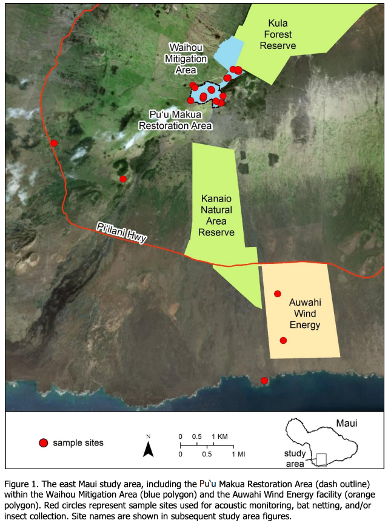
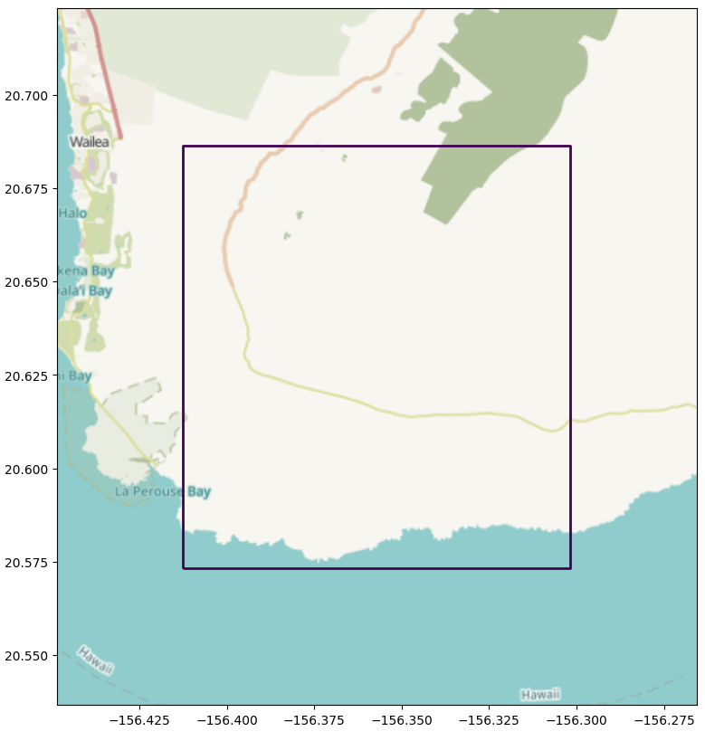

# Georeferencing figures in ecology papers

...a benchmark dataset.

## What's the big picture?

Ecologists all over the world deploy sensors and make “boots on the ground” observations to answer critical questions about ecosystems: What species are where? How are wildlife populations impacted by human activity and climate change?  The primary output of this massive global effort is not structured data, but rather written reports: academic papers, environmental impact assessments, and commissioned reports.  The information in those reports often eventually makes its way into policy, e.g. into decisions about CITES/ESA/IUCN species listings, but only with tremendous amounts of effort by human experts to distill information from numerous written sources.  And just as often, reports are as far as information from a wildlife survey will percolate: if the next link on the policy chain doesn’t discover a publication, or if that publication gets buried in a stack of hundreds, information can easily be “lost in plain sight”.

Furthermore, the few structured databases that exist to capture wildlife population information lack much of the nuance that was present when information was captured in the field: [GBIF](https://gbif.org), for example, is the largest repository of species occurrence records, but most observations stored in GBIF only report that species S was seen at around time T and near location X/Y; information about survey methodology and survey effort - critical to making inferences about what that observation means - is often lost, making it challenging to infer population sizes or trends from most structured data sources.

But all of that information isn’t really lost, it’s just too cumbersome for humans to digest from the original sources.  A quick Google Scholar search for virtually any taxo (e.g. [turtles](https://scholar.google.com/scholar?hl=en&as_sdt=0%2C48&q=turtle+population+survey&btnG=), [wolverines](https://scholar.google.com/scholar?hl=en&as_sdt=0%2C48&q=wolverine+population+survey&btnG=)) will yield tens of thousands of papers, each applying one or more methodologies to estimate the population of one or more species in a region.  Combined, those papers provide comprehensive insight about species and ecosystems, but extracting and summarizing that information requires not only reading thousands of pages of text, but also referencing non-standardized maps of study areas and survey designs, typically locked in figures like this one:

Image credit: USGS

We hypothesize that multimodal LLMs can enable the extraction of structured information from decades of ecological literature, allowing previously-impossible queries about wildlife populations, and enhancing existing repositories with information that was previously available only with exhaustive human effort.

## That sounds great.  What's standing in the way?

Before we can ask high-level questions that connect figure content to spatial context, we need to be able to connect a figure to a real location on Earth, i.e. we need to be able to georeference figures that are extracted from papers, with assistance from the caption and the paper text.  We call this task "figure georeferencing".

## What's in this repo?

This repo contains a set of ground truth data points that will facilitate the evaluaton of current LLMs on the figure georeferencing task.  Specifically, for each data point, we provide:

* A PDF file of an ecology paper, along with a link to the original paper,
* An image of a figure that has been extracted from that PDF file
* A .geojson file containing the true extent of that figure in spatial coordinates

There is some nuance to defining the georeferenced area.  In general, we tried to answer the question "what is the true area of interest represented in this figure?"  That led to the following rules:

* Often figures contain an area of interest, and an inset to indicate context.  For example, a figure might be a map of a study area located in Wisconsin, and an inset might contain an image of Wisconsin with the study area highlighted.  In these cases, we treat the <i>smallest</i> area represented in the map as the AOI.
* We excluded figures from this version of the dataset where multiple such AOIs exist.
* When a figure contains a visible box separating a map from the figure background, we georeferenced the area of the box.
* When a figure does not contain a visible box, for example when a figure contains a map of an island floating on a white background, we georeferenced a region that is cropped tightly to the non-empty content.

Specifically, the "georeferencing" folder contains:

* "index.csv": a .csv file in which each row corresponds to one data point, with the following columns:
  * <i>record_id</i>: a unique ID that will be used to refer to files associated with this data point, based on the paper title, e.g. "distribution_abundance_and_breeding_activities"
  * <i>paper_title</i>: the title of the paper on which this data point is based
  * <i>figure_number</i>: the figure number that was georeferenced
  * <i>paper_link</i>: a link to the original paper
  * <i>pdf_filename</i>: the filename of the PDF file within the "PDFs" folder
  * <i>geojson_filename</i>: the filename of the geojson file within the "annotations" folder
  * <i>image_filename</i>: the filename of the image file within the "images" folder

* "pdfs": a folder containing PDF files
* "annotations": a folder containing geojson files
* "images": a folder containing image files
* "georeferencing.ipynb": a sample notebook that reads index.csv and plots one or more of the georeferenced boxes on a map, alongside the corresponding image

Multiple data points may have the same record_id and paper_title, but different figure_number values.

Here is an example of what the sample notebook renders after loading the .geojson annotation for the above figure:

*This is not an officially supported Google product.*

